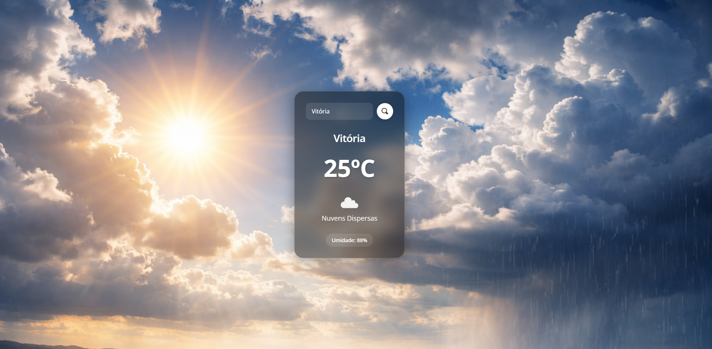

# Weather App

Projeto simples de previsão do tempo desenvolvido com React. A aplicação consome dados de uma API pública e exibe informações climáticas atualizadas em tempo real para a cidade pesquisada.

É possível visualizar dados como temperatura atual, condição do clima, umidade e outras informações relevantes de forma clara e intuitiva.

## Acesse o projeto

[weather-app-atmosy.vercel.app](https://weather-app-atmosy.vercel.app/)

## Preview

## Tecnologias utilizadas

- React  
- TypeScript  
- Vite  
- API de clima  

## Funcionalidades

- Busca de cidade em tempo real  
- Exibição da temperatura atual  
- Exibição da condição climática  
- Exibição da umidade do ar   
- Interface simples e responsiva  